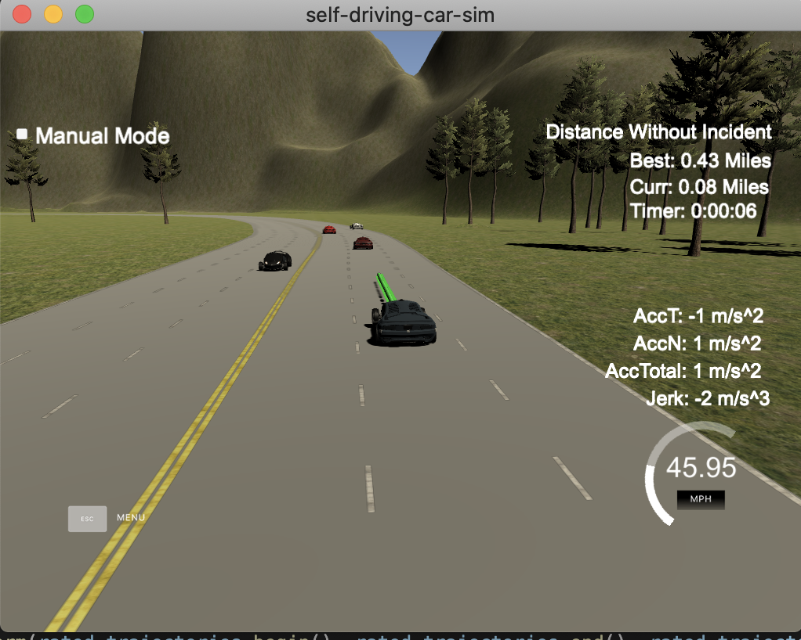

# Motion Planning 

[](https://gitlab.com/jinay1991/motion_planning/commits/master)
[](https://jinay1991.gitlab.io/motion_planning/index.html)
[](https://jinay1991.gitlab.io/motion_planning/doc/html/)

[[Issue Board](https://gitlab.com/jinay1991/motion_planning/-/boards)]

Autonomous Driving Motion Planning (with conjunction with Udacity Simulator) 

This repository contains one of the subsystem for Autonomous Driving Platform.

### Autonomous Driving Platform Subsystems

1. Perception
2. Planning
3. Control

## Developer Notes

Please remember that Repository work is `In Progress` and may contain incomplete/broken functionality for some of the components.
Keep track of Issue Tracker to see current status of the Work or report new issue if you encounter or contact maintainer of the repository (listed in `CONTRIBUTING.md`) to get clarity on the issues.

## Build

* Build project
    * Release `bazel build //...`
    * Debug `bazel build -c dbg //...`
* Run Unit Tests `bazel test //... --test_output=all`

## Test

* Launch Simulator 
* Run `./bazel-bin/client-app data/highway-map.csv`



## Dependencies

* [Bazel](https://docs.bazel.build/versions/1.1.0/getting-started.html) 
* [uWebSockets](https://github.com/uWebSockets/uWebSockets)
  * Run either `install-mac.sh` or `install-ubuntu.sh`.
  * If you install from source, checkout to commit `e94b6e1`, i.e.
    ```
    git clone https://github.com/uWebSockets/uWebSockets
    cd uWebSockets
    git checkout e94b6e1
    ```
* Simulator
    * Download prebuilt binaries
        * [Linux](https://github.com/udacity/self-driving-car-sim/releases/download/T3_v1.2/term3_sim_linux.zip) 
        * [MacOS](https://github.com/udacity/self-driving-car-sim/releases/download/T3_v1.2/term3_sim_mac.zip)
        * [MacOS Catalina v10.15](https://github.com/jinay1991/motion_planning/releases/download/v1.1/term3_sim_mac_catalina.zip)
        * [Windows](https://github.com/udacity/self-driving-car-sim/releases/download/T3_v1.2/term3_sim_windows.zip)

## Supported OS 

Currently project works (tested) on following Operating Systems:

* macOS Catalina > v10.15
* Ubuntu 18.04
* Docker Engine v2.1.0 (stable)

## Third-Party

Repository uses some of the third party library as follows, which are being downloaded and linked with Bazel Rules defined in `WORKSPACE` and `bazel/` of this repository.

* [nlohmann/units](https://github.com/nholthaus/units)
* [nholthaus/json](https://github.com/nlohmann/json)
* [uWebSockets](https://github.com/uWebSockets/uWebSockets)
* [GTest](https://github.com/google/googletest)
* [Eigen3](https://bitbucket.org/eigen/eigen)
* [Spline](https://github.com/ttk592/spline)

## Docker

If one want to use Docker Image for quick and easy built-test. Follow below steps:

1. Install [Docker](https://docs.docker.com/v17.09/engine/installation/) for respective OS.
2. Pull Latest Docker Image 

    ```
    ~$ docker pull registry.gitlab.com/jinay1991/motion_planning:latest
    ```

3. Launch Docker Container for the downloaded image and share checked out repository with docker container

    ```
    motion_planning~$ docker run -it -v $(pwd):/workspace registry.gitlab.com/jinay1991/motion_planning:latest
    ```

4. Build and test within docker container

    ```
    workspace~# bazel build //... 
    workspace~# bazel test //... --test_output=all
    ```
